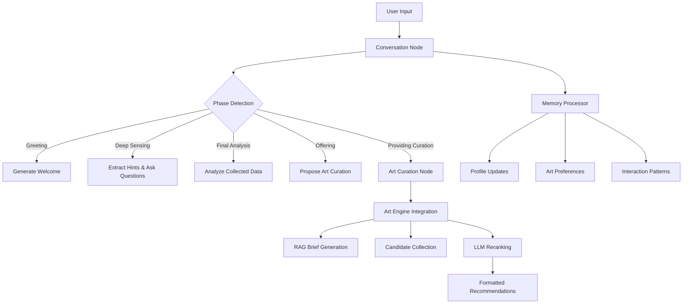

# Emotional Art Graph Code Guide

A comprehensive technical guide to the emotional art recommendation system built with LangGraph, featuring conversational AI, persistent memory, and automated art curation.

## Table of Contents

1. [System Overview](#system-overview)
2. [Architecture Components](#architecture-components)
3. [State Management](#state-management)
4. [Memory Schemas](#memory-schemas)
5. [Conversation Phase Management](#conversation-phase-management)
6. [Memory Processing](#memory-processing)
7. [Art Curation Integration](#art-curation-integration)
8. [Graph Nodes](#graph-nodes)
9. [Routing Logic](#routing-logic)
10. [Integration Points](#integration-points)
11. [Error Handling & Reliability](#error-handling--reliability)
12. [Usage Examples](#usage-examples)

## System Overview

The Emotional Art Graph is a sophisticated conversational AI system that:

- **Engages users in empathetic conversations** to understand their emotional state
- **Extracts emotional and situational hints** through natural dialogue
- **Manages persistent user memory** across sessions using LangGraph's store
- **Provides personalized art recommendations** using an integrated curation engine
- **Maintains conversation flow** with intelligent phase management

### Key Features

- **Multi-phase conversation management** with natural transitions
- **Thread-safe memory processing** with Trustcall extractors
- **Asynchronous art curation** with timeout handling
- **Persistent user profiling** and preference learning
- **Robust error handling** and fallback mechanisms

## Architecture Components



## State Management

### EmotionalArtState Class

The core state management is handled by the `EmotionalArtState` class, which extends LangGraph's `MessagesState`:

```python
class EmotionalArtState(MessagesState):
    """Emotional art state for extended conversation tracking"""
    
    # Core conversation data
    current_phase: str = "greeting"
    
    # Extended conversation tracking
    conversation_depth: int = 0
    min_sensing_turns: int = 4
    
    # Gradual emotion/situation building
    emotion_hints: List[str] = []
    situation_hints: List[str] = []
    
    # Final detected state
    final_situation: str = ""
    final_emotions: List[str] = []
    confidence_score: float = 0.0
    
    # Recommendation flow control
    consent_for_reco: bool = False
    last_recommendations: List[dict] = []
    
    # Memory and safety
    memory_enabled: bool = False
    safety_notes: str = ""
```

### State Lifecycle

1. **Initialization**: Starts in "greeting" phase with empty emotion/situation hints
2. **Conversation Building**: Accumulates hints and increases depth
3. **Analysis Phase**: Performs final analysis when sufficient data is collected
4. **Consent Management**: Tracks user willingness for art recommendations
5. **Curation Phase**: Manages art recommendation delivery

## Memory Schemas

The system uses three distinct memory schemas for persistent user data:

### UserProfile Schema

```python
class UserProfile(BaseModel):
    """User profile schema"""
    name: Optional[str] = Field(description="User Name", default=None)
    location: Optional[str] = Field(description="User Location", default=None)
    job: Optional[str] = Field(description="Job", default=None)
    emotional_context: Optional[str] = Field(description="Current Emotional State", default=None)
    life_situation: Optional[str] = Field(description="Current Life Situation", default=None)
    connections: List[str] = Field(description="Relationships", default_factory=list)
    interests: List[str] = Field(description="Interests or Hobbies", default_factory=list)
```

### ArtPreferences Schema

```python
class ArtPreferences(BaseModel):
    """Art preferences schema"""
    liked_styles: List[str] = Field(description="Liked Art Styles", default_factory=list)
    avoided_topics: List[str] = Field(description="Topics to Avoid", default_factory=list)
    helpful_motifs: List[str] = Field(description="Helpful Motives or Themes", default_factory=list)
    effective_colors: List[str] = Field(description="Effective Colors", default_factory=list)
    calming_themes: List[str] = Field(description="Calming Themes", default_factory=list)
    feedback_history: List[str] = Field(description="Feedback about Artwork", default_factory=list)
```

### InteractionPatterns Schema

```python
class InteractionPatterns(BaseModel):
    """Interaction patterns schema"""
    preferred_communication_style: Optional[str] = Field(description="Preferred Communication Style", default=None)
    effective_approaches: List[str] = Field(description="Effective Approaches", default_factory=list)
    conversation_preferences: List[str] = Field(description="Conversation Preferences", default_factory=list)
    successful_interventions: List[str] = Field(description="Successful Interventions", default_factory=list)
    user_feedback: List[str] = Field(description="User Feedback", default_factory=list)
```

## Conversation Phase Management

### ConversationPhaseManager Class

The `ConversationPhaseManager` handles the intelligent flow of conversation phases:

```python
class ConversationPhaseManager:
    """Handle extended conversation flow within the main node"""

    def __init__(self, llm):
        self.llm = llm
```

### Phase Detection Logic

```python
async def detect_phase(self, state: EmotionalArtState) -> str:
    """Determine current conversation phase based on extended conversation tracking"""
    
    human_messages = [msg for msg in state.get("messages", []) if isinstance(msg, HumanMessage)]
    
    if len(human_messages) <= 1:
        return "greeting"
    elif state.get("conversation_depth", 0) < 3:
        return "deep_sensing"
    elif not state.get("final_situation"):
        readiness = await self.assess_curation_readiness(state)
        if readiness["ready"] and readiness["confidence"] >= 0.7:
            return "final_analysis"
        else:
            return "deep_sensing"
    # ... additional phase logic
```

### Emotion and Situation Extraction

The system continuously extracts emotional and situational hints from user messages:

```python
async def extract_emotion_hints(self, message_content: str) -> List[str]:
    """Extract emotion hints from message using LLM"""
    emotion_prompt = f"""
    Analyze this message and extract emotional indicators:
    
    Message: "{message_content}"
    
    Extract 2-4 key emotional states or feelings expressed or implied.
    Return only the emotions as a comma-separated list (e.g., "stressed, anxious, overwhelmed").
    If no clear emotions, return "neutral".
    """
    
    try:
        response = await self.llm.ainvoke([SystemMessage(content=emotion_prompt)])
        emotions_str = response.content.strip()
        
        if emotions_str.lower() == "neutral":
            return []
        
        emotions = [e.strip() for e in emotions_str.split(',')]
        return emotions[:4]
    except Exception as e:
        print(f"Emotion extraction error: {e}")
        return []
```

### Contextual Question Generation

The system generates empathetic responses based on accumulated conversation context:

```python
async def generate_contextual_question(self, state: EmotionalArtState, user_context: dict = None) -> str:
    """Generate empathetic response and question based on conversation context"""
    
    recent_messages = state.get("messages", [])[-4:]
    conversation_text = "\n".join([f"{msg.type}: {msg.content}" for msg in recent_messages])
    
    emotion_hints = state.get("emotion_hints", [])
    situation_hints = state.get("situation_hints", [])
    depth = state.get("conversation_depth", 0)
    
    # Extract user name from memory
    user_name = ""
    if user_context:
        user_name = extract_user_name_from_memory(user_context)
    
    question_prompt = f"""
    You are a warm, friendly companion who genuinely cares about the user...
    
    Current conversation:
    {conversation_text}
    
    Emotion hints collected so far: {emotion_hints}
    Situation hints collected so far: {situation_hints}
    Conversation depth: {depth}
    
    Generate a response that feels like talking to a close friend who really gets you.
    """
    
    try:
        response = await self.llm.ainvoke([SystemMessage(content=question_prompt)])
        return response.content.strip()
    except Exception as e:
        return "Hey, it sounds like you've got a lot on your mind. What's been the biggest thing bothering you lately?"
```

## Memory Processing

### Thread-Safe Memory Processor

The system uses a dedicated `ThreadSafeMemoryProcessor` to handle memory updates without blocking the main conversation flow:

```python
class ThreadSafeMemoryProcessor:
    """Handles memory updates in separate thread pool to avoid async/sync conflicts"""
    
    def __init__(self, max_workers=2):
        self.executor = concurrent.futures.ThreadPoolExecutor(max_workers=max_workers)
        
    async def process_memory_update(self, memory_type: str, messages: list, 
                                  existing_memories: list, namespace: tuple, 
                                  store: BaseStore, emotion_hints: list = None, 
                                  situation_hints: list = None):
        """Process memory update in separate thread"""
        
        sync_update_func = partial(
            self._sync_memory_update,
            memory_type=memory_type,
            messages=messages,
            existing_memories=existing_memories,
            namespace=namespace,
            emotion_hints=emotion_hints,
            situation_hints=situation_hints
        )
        
        try:
            # Run in thread pool to avoid event loop conflicts
            result = await asyncio.get_event_loop().run_in_executor(
                self.executor, 
                sync_update_func
            )
            
            # Store results back to LangGraph store (async)
            if result and result.get('updates'):
                for update_data in result['updates']:
                    await store.aput(
                        namespace, 
                        update_data['key'], 
                        update_data['value']
                    )
            
            return result
            
        except Exception as e:
            print(f"DEBUG: Memory processing failed: {e}")
            return None
```

### Trustcall Integration

The system uses Trustcall extractors for structured memory extraction:

```python
# Create extractors
profile_extractor = create_extractor(
    llm,
    tools=[UserProfile],
    tool_choice="UserProfile",
)

art_preference_extractor = create_extractor(
    llm,
    tools=[ArtPreferences],
    tool_choice="ArtPreferences",
    enable_inserts=True
)

interaction_extractor = create_extractor(
    llm,
    tools=[InteractionPatterns],
    tool_choice="InteractionPatterns",
    enable_inserts=True
)
```

## Art Curation Integration

### Curation Input Preparation

The system converts user memories and conversation state into structured input for the art curation engine:

```python
def prepare_curation_input(user_memories: dict, conversation_state: EmotionalArtState) -> dict:
    """Convert user memories + conversation context into art_curation_engine input"""
    
    # 1. Situation aggregation (70% current + 30% background context)
    current_situation = user_memories.get('user_profile', {}).get('current_situation', '')
    emotional_context = user_memories.get('user_profile', {}).get('emotional_context', '')
    
    situation = f"{current_situation}"
    if emotional_context and emotional_context != current_situation:
        situation += f" with underlying {emotional_context}"
    
    # 2. Emotions prioritization (conversation > stored)
    emotions = []
    emotion_hints = conversation_state.get('emotion_hints', [])
    if emotion_hints:
        emotions.extend(emotion_hints[:3])  # Top 3 from conversation
    
    # 3. Art preferences (when available)
    art_prefs = user_memories.get('art_preferences', {})
    preferences = None
    if art_prefs:
        preferences = {
            "liked_styles": art_prefs.get('preferred_styles', [])[:5],
            "avoided_themes": art_prefs.get('avoided_themes', [])[:5],
            "effective_colors": art_prefs.get('effective_colors', [])[:5],
            "preferred_periods": art_prefs.get('preferred_periods', [])[:3]
        }
    
    return {
        "situation": situation.strip(),
        "emotions": emotions,
        "preferences": preferences,
        "confidence_level": min(1.0, len(emotions) * 0.2 + (0.3 if preferences else 0))
    }
```

### Art Curation Execution

The curation process integrates with the external art curation engine:

```python
async def handle_curation_request(state: EmotionalArtState, config: RunnableConfig, store: BaseStore):
    """Execute art curation with timeout and error handling"""
    
    # 1. Prepare input
    user_memories = await load_user_memories(config, store)
    curation_input = prepare_curation_input(user_memories, state)
    
    # 2. Change to art_curation_engine working directory
    original_cwd = os.getcwd()
    art_engine_dir = os.path.join(os.path.dirname(__file__), 'art_curation_engine')
    
    try:
        os.chdir(art_engine_dir)
        
        # 3. Import and initialize (lazy loading for performance)
        from art_curation_engine.core import RAGSessionBrief, StageACollector, Step6LLMReranker
        
        rag_session = RAGSessionBrief()
        stage_a = StageACollector()
        reranker = Step6LLMReranker(batch_size=5, max_workers=2)
        
        # 4. Execute pipeline with timeouts
        start_time = time.time()
        
        # Step 5: Research brief (timeout: 30s)
        brief = await asyncio.wait_for(
            rag_session.generate_brief(curation_input['situation'], curation_input['emotions']),
            timeout=30.0
        )
        
        # Stage A: Candidate collection (timeout: 15s)
        candidates_result = await asyncio.wait_for(
            stage_a.collect_candidates(curation_input['situation'], curation_input['emotions']),
            timeout=15.0
        )
        
        # Step 6: Reranking (timeout: 45s)
        candidate_ids = candidates_result.get("final_stageA_ids", [])
        candidates = [{"artwork_id": cid} for cid in candidate_ids]
        
        final_recs = await asyncio.wait_for(
            reranker.rerank_candidates(brief, candidates, 8),
            timeout=45.0
        )
        
        processing_time = time.time() - start_time
        
        # 5. Format for conversation
        response_text = format_recommendations_for_chat(final_recs, curation_input, processing_time)
        
        return {
            "messages": [AIMessage(content=response_text)],
            "last_curation_result": final_recs,
            "current_phase": "continuing",
            "curation_metadata": {
                "processing_time": processing_time,
                "confidence_level": curation_input["confidence_level"],
                "preferences_used": bool(curation_input["preferences"])
            }
        }
        
    except asyncio.TimeoutError:
        timeout_msg = ("I'm still working on finding the perfect artwork for you. "
                      "Let's continue our conversation while I process that in the background.")
        return {
            "messages": [AIMessage(content=timeout_msg)],
            "current_phase": "continuing"
        }
    finally:
        os.chdir(original_cwd)
```

## Graph Nodes

### Conversation Node

The main conversation processing node handles all dialogue phases:

```python
async def conversation_node(state: EmotionalArtState, config: RunnableConfig, store: BaseStore):
    """Conversation-only node - emotion extraction, memory updates, basic response handling"""
    
    # Load user memories and initialize phase manager
    user_context = await load_user_memories(config, store)
    phase_manager = ConversationPhaseManager(llm)
    current_phase = await phase_manager.detect_phase(state)
    
    # Get the last user message
    last_user_message = None
    for msg in reversed(state["messages"]):
        if isinstance(msg, HumanMessage):
            last_user_message = msg.content
            break
    
    # Extract hints from user message
    if last_user_message:
        emotion_hints = await phase_manager.extract_emotion_hints(last_user_message)
        situation_hints = await phase_manager.extract_situation_hints(last_user_message)
        
        # Merge with existing hints
        current_emotion_hints = state.get("emotion_hints", [])
        current_situation_hints = state.get("situation_hints", [])
        
        all_emotion_hints = current_emotion_hints + emotion_hints
        all_situation_hints = current_situation_hints + situation_hints
        
        # Remove duplicates and limit to 5
        state_updates["emotion_hints"] = list(dict.fromkeys(all_emotion_hints))[-5:]
        state_updates["situation_hints"] = list(dict.fromkeys(all_situation_hints))[-5:]
    
    # Phase-specific processing
    if current_phase == "greeting":
        response_content = generate_greeting_response(user_context)
    elif current_phase == "deep_sensing":
        state_updates["conversation_depth"] = state.get("conversation_depth", 0) + 1
        response_content = await phase_manager.generate_contextual_question(state, user_context)
    elif current_phase == "final_analysis":
        # Perform final analysis and transition to offering
        # ... (detailed analysis logic)
    # ... (additional phase handling)
    
    # Process memory updates if needed
    if memory_analysis["update_needed"]:
        # Background memory processing
        # ... (memory update logic)
    
    return {"messages": [AIMessage(content=response_content)], **state_updates}
```

### Art Curation Node

Dedicated node for art recommendation processing:

```python
async def art_curation_node(state: EmotionalArtState, config: RunnableConfig, store: BaseStore):
    """Art curation dedicated node - Art Curation Engine execution"""
    
    # Load user memories
    user_memories = await load_user_memories(config, store)
    
    # Prepare curation input
    curation_input = prepare_curation_input(user_memories, state)
    
    # Execute art curation pipeline
    try:
        # Import and initialize art engine components
        from art_curation_engine.core import RAGSessionBrief, StageACollector, Step6LLMReranker
        
        # Execute the full pipeline
        # ... (curation execution logic)
        
        # Format and return recommendations
        response_text = format_recommendations_for_chat(final_recs, curation_input, processing_time)
        
        return {
            "messages": [AIMessage(content=response_text)],
            "last_curation_result": final_recs,
            "current_phase": "continuing"
        }
        
    except Exception as e:
        # Error handling with graceful fallback
        return {
            "messages": [AIMessage(content="I'm having trouble with the art recommendations right now. Let's keep chatting!")],
            "current_phase": "continuing"
        }
```

## Routing Logic

### Conditional Routing

The system uses conditional edges to determine the flow between nodes:

```python
def should_curate_art(state: EmotionalArtState) -> Literal["art_curation_node", END]:
    """Conditional routing to determine if art curation is needed"""
    
    current_phase = state.get("current_phase", "")
    
    # Execute art curation only in ready_for_curation phase or when user consents
    if (current_phase == "ready_for_curation" or 
        state.get("consent_for_reco", False)):
        return "art_curation_node"
    else:
        return END
```

### Graph Construction

```python
# Create StateGraph
builder = StateGraph(EmotionalArtState)

# Add nodes
builder.add_node("conversation_node", conversation_node)
builder.add_node("art_curation_node", art_curation_node)

# Define edges
builder.add_edge(START, "conversation_node")
builder.add_conditional_edges(
    "conversation_node",
    should_curate_art,
    {
        "art_curation_node": "art_curation_node",
        END: END
    }
)
builder.add_edge("art_curation_node", END)

# Compile graph
graph = builder.compile()
```

## Integration Points

### LangGraph Store Integration

The system seamlessly integrates with LangGraph's persistent store:

```python
async def load_user_memories(config: RunnableConfig, store: BaseStore) -> dict:
    """Load user memories"""
    user_id = config.get("configurable", {}).get("user_id") or config.get("configurable", {}).get("thread_id", "default_user")

    # Load profile memory
    profile_namespace = ("profile", user_id)
    profile_memories = await store.asearch(profile_namespace)
    profile = profile_memories[0].value if profile_memories else None

    # Load art preferences memory
    art_namespace = ("art_preferences", user_id)
    art_memories = await store.asearch(art_namespace)
    art_preferences = [mem.value for mem in art_memories]

    # Load interaction patterns memory
    interaction_namespace = ("interaction_patterns", user_id)
    interaction_memories = await store.asearch(interaction_namespace)
    interaction_patterns = [mem.value for mem in interaction_memories]

    return {
        "profile": profile,
        "art_preferences": art_preferences,
        "interaction_patterns": interaction_patterns
    }
```

### OpenAI LLM Integration

The system uses OpenAI's GPT-4o for all language processing:

```python
# Initialize LLM
llm = ChatOpenAI(
    model="gpt-4o",
    api_key=os.environ.get("OPENAI_API_KEY"),
    base_url="https://api.openai.com/v1",
    temperature=0.7
)
```

## Error Handling & Reliability

### Graceful Degradation

The system implements multiple levels of error handling:

```python
try:
    # Main processing logic
    response = await self.llm.ainvoke([SystemMessage(content=emotion_prompt)])
    emotions_str = response.content.strip()
    
    if emotions_str.lower() == "neutral":
        return []
    
    emotions = [e.strip() for e in emotions_str.split(',')]
    return emotions[:4]
except Exception as e:
    print(f"Emotion extraction error: {e}")
    return []  # Graceful fallback
```

### Memory Fallbacks

```python
# Add store validation and fallback handling
if store is None:
    print("WARNING: Store is None, using InMemoryStore fallback")
    from langgraph.store.memory import InMemoryStore
    store = InMemoryStore()
```

### Timeout Management

```python
# Execute with timeout protection
try:
    brief = await asyncio.wait_for(
        rag_session.generate_brief(curation_input['situation'], curation_input['emotions']),
        timeout=30.0
    )
except asyncio.TimeoutError:
    timeout_msg = ("I'm still working on finding the perfect artwork for you. "
                  "Let's continue our conversation while I process that in the background.")
    return {"messages": [AIMessage(content=timeout_msg)], "current_phase": "continuing"}
```

## Usage Examples

### Basic Conversation Flow

```python
# Initialize and run the graph
config = {"configurable": {"user_id": "user123"}}
initial_state = {"messages": [HumanMessage(content="Hi, I'm feeling really stressed today")]}

# Process the conversation
result = await graph.ainvoke(initial_state, config)
print(result["messages"][-1].content)
# Output: Empathetic response asking about stress sources
```

### Memory Persistence Example

```python
# First conversation
state1 = {"messages": [HumanMessage(content="My name is Sarah and I work as a teacher")]}
result1 = await graph.ainvoke(state1, config)

# Later conversation (same user_id)
state2 = {"messages": [HumanMessage(content="I'm having a tough day at work")]}
result2 = await graph.ainvoke(state2, config)
# System remembers Sarah's name and teaching profession
```

### Art Curation Example

```python
# Multi-turn conversation leading to curation
conversation = [
    HumanMessage(content="I've been feeling overwhelmed with work lately"),
    AIMessage(content="That sounds really challenging..."),
    HumanMessage(content="Yeah, I can't seem to relax even when I'm home"),
    AIMessage(content="I wonder if some artwork might help you process these feelings? Want me to find some pieces that might really speak to you right now?"),
    HumanMessage(content="Yes, that sounds great!")
]

state = {"messages": conversation}
result = await graph.ainvoke(state, config)
# System provides personalized art recommendations
```

## Key Implementation Patterns

### 1. Asynchronous Processing

All major operations are implemented with async/await patterns for non-blocking execution:

```python
async def detect_phase(self, state: EmotionalArtState) -> str:
    # Async phase detection logic
```

### 2. State Immutability

State updates are handled through return dictionaries rather than direct mutation:

```python
return {"messages": [AIMessage(content=response_content)], **state_updates}
```

### 3. Graceful Error Handling

Every external operation includes try-catch blocks with meaningful fallbacks:

```python
try:
    # Complex operation
    return successful_result
except Exception as e:
    print(f"Operation failed: {e}")
    return fallback_result
```

### 4. Memory Separation

Different types of memory (profile, preferences, interactions) are stored in separate namespaces:

```python
profile_namespace = ("profile", user_id)
art_namespace = ("art_preferences", user_id)
interaction_namespace = ("interaction_patterns", user_id)
```

This comprehensive guide provides developers with the knowledge needed to understand, modify, and extend the emotional art recommendation system effectively.