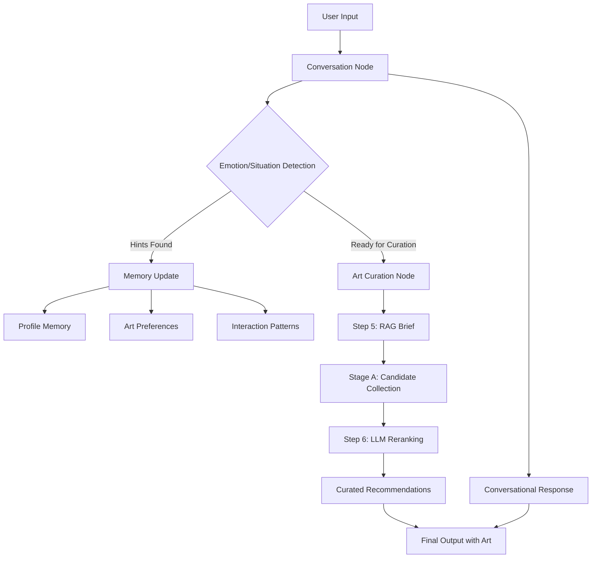
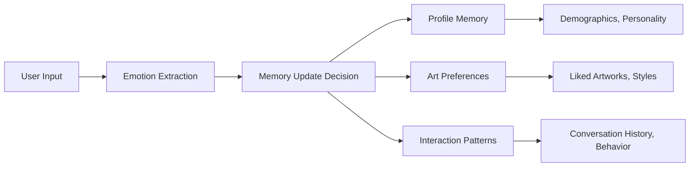
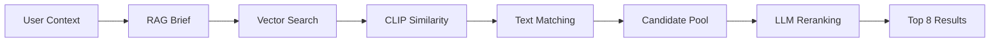

# Emotional Art Docent - LangGraph

An intelligent conversational AI docent that provides personalized art recommendations based on emotional analysis. Built with LangGraph, this system analyzes user emotions and contexts to deliver curated art experiences.

## 🎯 Key Features

- **Emotion-Based Conversation Analysis**: Real-time extraction of user emotions and situational context
- **Intelligent Memory System**: Learning user profiles, art preferences, and interaction patterns
- **3-Stage Art Curation Pipeline**: RAG Brief Generation → Candidate Collection → LLM Reranking
- **Asynchronous Processing**: Timeout management and thread-safe memory handling
- **Modular Architecture**: Separated conversation and curation nodes for scalability

## 🔄 System Pipeline

### Input → Processing → Output Flow



### Detailed Processing Pipeline

#### 1. **Input Processing**
```
User Input: "I'm feeling stressed about work and need something calming"
    ↓
Emotion Extraction: ["stressed", "overwhelmed"]
Situation Extraction: ["work", "need calming"]
    ↓
Memory Context: Previous preferences, interaction history
```

#### 2. **Art Curation Pipeline**
```
Step 5: RAG Brief Generation
├── Input: Emotions + Situation + User Context
├── Process: RAG system generates contextual art brief
└── Output: "Find calming, nature-inspired artworks for stress relief"

Stage A: Candidate Collection  
├── Input: Brief + Emotion/Situation vectors
├── Process: CLIP similarity + Text matching
└── Output: 50-100 candidate artworks with scores

Step 6: LLM Reranking
├── Input: Brief + Candidates + User preferences
├── Process: GPT-4 contextual reranking
└── Output: Top 8 personalized recommendations
```

#### 3. **Output Generation**
```
Final Response:
├── Conversational Context: Empathetic response to user's stress
├── Art Recommendations: 8 curated artworks with explanations
├── Metadata: Processing time, confidence scores
└── Memory Updates: Updated user profile and preferences
```

## 🏗 Architecture Overview

### High-Level System Architecture
```
┌─────────────────┐    ┌──────────────────┐
│ Conversation    │    │ Art Curation     │
│ Node            │───▶│ Node             │
└─────────────────┘    └──────────────────┘
         │                       │
         ▼                       ▼
┌─────────────────┐    ┌──────────────────┐
│ Memory System   │    │ Art Curation     │
│ - Profile       │    │ Engine           │
│ - Preferences   │    │ - RAG Brief      │
│ - Interactions  │    │ - Stage A        │
└─────────────────┘    │ - Step 6         │
                       └──────────────────┘
```

### Memory System Architecture


## 🚀 Quick Start

### 1. Installation

```bash
git clone <repository-url>
cd arti_llm
pip install -r requirements.txt
```

### 2. Environment Setup

Create a `.env` file with the following configuration:

```bash
# API Keys
OPENAI_API_KEY=your-api-key-here
FIREWORKS_API_KEY=your-fireworks-key
OPENAI_BASE_URL=https://api.fireworks.ai/inference/v1

# HuggingFace Cache Paths
HF_HOME=/Users/your-username/.cache/huggingface
TRANSFORMERS_CACHE=/Users/your-username/.cache/huggingface/transformers
HUGGINGFACE_HUB_CACHE=/Users/your-username/.cache/huggingface/hub
```

### 3. Run LangGraph Studio

```bash
source .env
export HF_HOME=/Users/your-username/.cache/huggingface
export TRANSFORMERS_CACHE=/Users/your-username/.cache/huggingface/transformers
export HUGGINGFACE_HUB_CACHE=/Users/your-username/.cache/huggingface/hub
langgraph dev --allow-blocking
```

The studio will be available at http://localhost:2024 (or custom port if specified)

### 4. Testing with Jupyter

Run the integration test notebook: `test_phase2_integration_async.ipynb`

## 📊 Example Usage

### Sample Conversation Flow

```
User: "I'm feeling overwhelmed with work lately. I need something to help me relax."

System Processing:
├── Emotion Detection: ["overwhelmed", "stressed"]
├── Situation Analysis: ["work pressure", "need relaxation"]
├── Memory Context: User prefers nature, previous calming recommendations
└── Curation Trigger: High confidence for art recommendation

Art Curation Process:
├── RAG Brief: "Find calming, nature-inspired artworks for stress relief"
├── Stage A: 73 candidates from landscape and abstract categories
├── Step 6: Reranked to 8 personalized recommendations
└── Processing Time: 2.3 seconds

System Response:
"I understand you're feeling overwhelmed with work. Here are some calming 
artworks that might help you find peace:

1. 'Water Lilies' by Claude Monet - The gentle blues and greens create...
2. 'The Great Wave' by Hokusai - Despite its dynamic energy, this piece...
[... 6 more recommendations with explanations]

Would you like to explore any of these further?"
```

## 📁 Project Structure

```
arti_llm/
├── emotional_art_graph.py      # Main LangGraph architecture
├── langgraph.json              # LangGraph configuration
├── art_curation_engine/        # Art curation engine
│   ├── core/
│   │   ├── langchain_rag_system.py    # RAG system
│   │   ├── stage_a_candidate_collection.py  # Candidate collection
│   │   └── step6_llm_reranking.py     # LLM reranking
│   └── data/                   # Art database
├── test_phase2_integration_async.ipynb  # Integration tests
├── CLAUDE.md                   # Development guide
├── LangGraph_Deployment_Guide.md      # Deployment guide
└── requirements.txt            # Dependencies
```

## 🔧 Core Components

### Conversation Node (`conversation_node`)
- **Emotion Extraction**: `extract_emotion_hints()` - Identifies emotional context
- **Situation Analysis**: `extract_situation_hints()` - Extracts situational context
- **Memory Management**: Updates Profile, Art Preferences, and Interaction Patterns

#### Memory Update Types:
```python
# Profile Memory
{
    "demographics": {"age_range": "25-35", "location": "urban"},
    "personality": {"openness": 0.8, "stress_level": "high"},
    "preferences": {"communication_style": "empathetic"}
}

# Art Preferences
{
    "preferred_styles": ["impressionism", "abstract"],
    "color_preferences": ["blue", "green", "earth_tones"],
    "emotional_associations": {"stress_relief": ["nature", "water"]}
}

# Interaction Patterns
{
    "conversation_frequency": "weekly",
    "preferred_response_length": "detailed",
    "engagement_level": "high"
}
```

### Art Curation Node (`art_curation_node`)
- **Step 5**: RAG-based brief generation using conversation context
- **Stage A**: CLIP + text similarity-based candidate collection (50-100 artworks)
- **Step 6**: LLM-based reranking for final 8 personalized recommendations

#### Processing Flow:


### Memory System
- **ThreadSafeMemoryProcessor**: Handles async/sync conflicts between LangGraph and Trustcall
- **BaseStore**: LangGraph's persistent memory storage with async operations
- **Auto-trigger System**: Automatically updates memory based on conversation hints

## 🛠 Development Information

### Recent Updates (2025-10-10)
- **LangGraph Studio Initialization Fix**: Resolved "Failed to initialize LangGraph Studio" error by ensuring execution from root directory
- **Project Structure Cleanup**: Successfully moved from `studio/` subdirectory structure to root-level organization
- **Data Format Fix**: Resolved candidate format compatibility between Stage A → Step 6
- **Architecture Separation**: Changed from monolithic to modular node structure
- **HuggingFace Cache Resolution**: Completely resolved /Volumes/X31 path issues

### Key Technical Solutions
```python
# Stage A Result Format
{
    "final_stageA_ids": ["artwork_1", "artwork_2", ...],  # List of IDs
    "clip_scores": {...},
    "debug": {...}
}

# Conversion to Step 6 Compatible Format
candidate_ids = candidates_result.get("final_stageA_ids", [])
candidates = [{"artwork_id": cid} for cid in candidate_ids]
```

## 🧪 Testing

### Unit Tests
```bash
pytest art_curation_engine/tests/
```

### Integration Tests
```bash
jupyter notebook test_phase2_integration_async.ipynb
```

### LangGraph Studio Testing
1. **Start the server**:
   ```bash
   # From project root directory
   source .env
   export HF_HOME=/Users/your-username/.cache/huggingface
   langgraph dev --allow-blocking
   ```

2. **Access the Studio**:
   - Open your browser and go to the URL shown in terminal output
   - Usually: `https://smith.langchain.com/studio/?baseUrl=http://127.0.0.1:2024`
   - API docs available at: `http://127.0.0.1:2024/docs`

3. **Test complete flow**:
   - Try sample conversations like: "I'm feeling stressed about work"
   - Monitor the console for DEBUG messages showing the pipeline execution
   - Verify art recommendations are generated successfully

4. **Important Notes**:
   - ⚠️ **Always run from the root project directory** (`arti_llm/`), not from any subdirectories
   - ⚠️ If you encounter initialization issues, kill existing processes and restart fresh
   - ⚠️ Make sure your `.env` file contains valid API keys for OpenAI/Fireworks

## 🐛 Troubleshooting

### Common Issues

1. **HuggingFace Cache Errors**
   ```bash
   export HF_HOME=/Users/your-username/.cache/huggingface
   ```

2. **Store is None Error**
   - Automatic InMemoryStore fallback is implemented

3. **Art Curation Failures**
   - Check data format compatibility between Stage A and Step 6

4. **Async/Await Errors**
   - Verify `loop.run_in_executor` pattern usage

5. **LangGraph Studio Initialization Issues**
   - **Problem**: "Failed to initialize LangGraph Studio" or "TypeError: Failed to fetch"
   - **Cause**: Running from wrong directory or old cached processes
   - **Solution**: 
     ```bash
     # Kill any existing processes
     pkill -f "langgraph dev"
     
     # Ensure you're in the root project directory
     cd /path/to/arti_llm
     
     # Start fresh from root directory (not studio subdirectory)
     source .env
     export HF_HOME=/Users/your-username/.cache/huggingface
     langgraph dev --allow-blocking
     ```

6. **Port Conflicts**
   - **Problem**: "Address already in use" error
   - **Solution**: Use a different port
     ```bash
     langgraph dev --port 8080 --allow-blocking
     ```

### Log Monitoring
- Check DEBUG messages in LangGraph Studio console
- Monitor step-by-step progress in `art_curation_node`

### Performance Considerations
- **Memory Usage**: The system maintains persistent user memories across sessions
- **Processing Time**: Art curation typically takes 2-5 seconds depending on complexity
- **Concurrent Users**: LangGraph handles multiple users with isolated memory stores

## 📚 Documentation

- [CLAUDE_EN.md](./CLAUDE_EN.md) - Detailed development guide
- [LangGraph_Deployment_Guide_EN.md](./LangGraph_Deployment_Guide_EN.md) - Deployment guide  
- [Art Curation Engine README](./art_curation_engine/README.md) - Curation engine documentation

## 🤝 Contributing

1. Fork the repository
2. Create your feature branch (`git checkout -b feature/AmazingFeature`)
3. Commit your changes (`git commit -m 'Add some AmazingFeature'`)
4. Push to the branch (`git push origin feature/AmazingFeature`)
5. Open a Pull Request

### Development Guidelines
- Follow existing code style and patterns
- Add tests for new features
- Update documentation as needed
- Ensure async/await patterns are properly implemented

## 📄 License

This project is distributed under the MIT License. See `LICENSE` file for more information.

## 🙏 Acknowledgments

- LangGraph team for the excellent framework
- HuggingFace team for model and embedding infrastructure
- Art Institute of Chicago for providing artwork data
- OpenAI and Fireworks AI for LLM services
