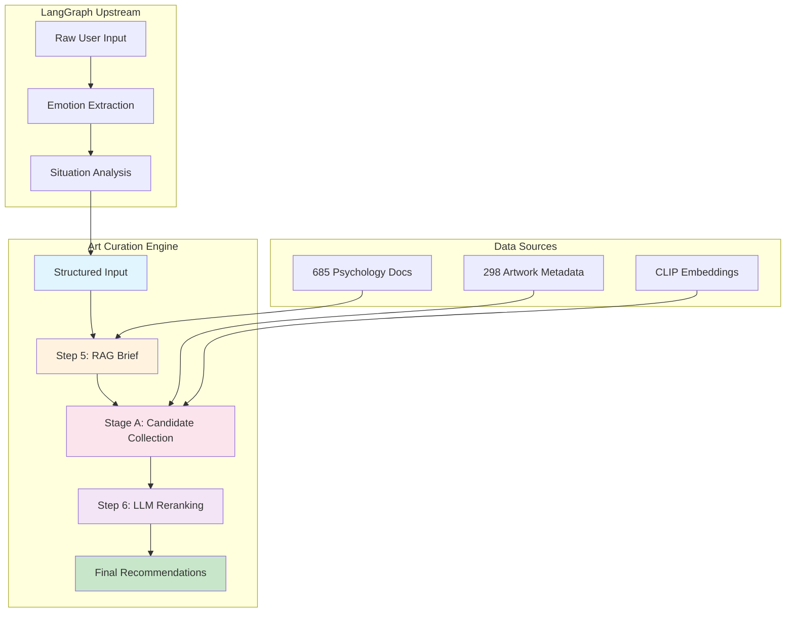
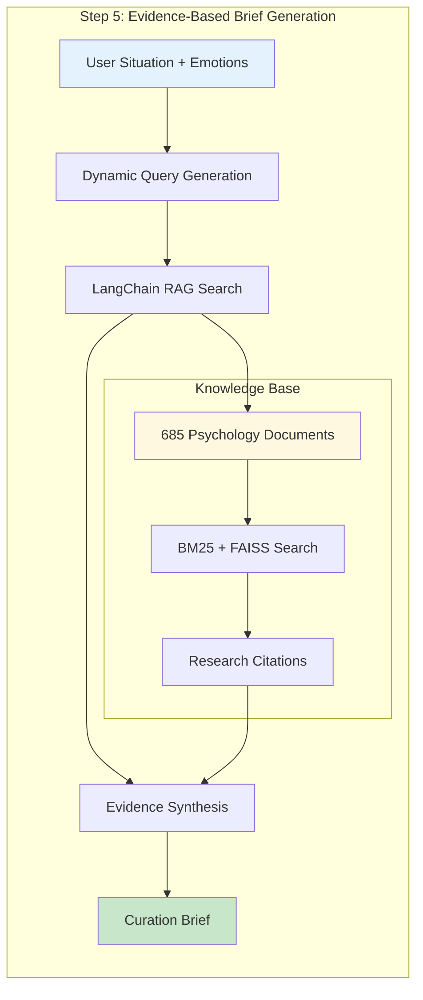
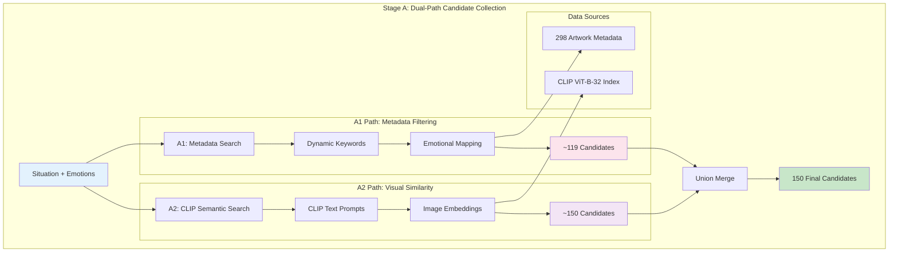
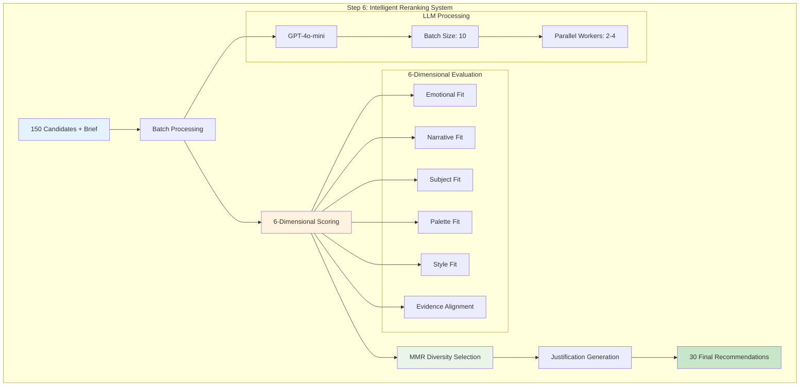
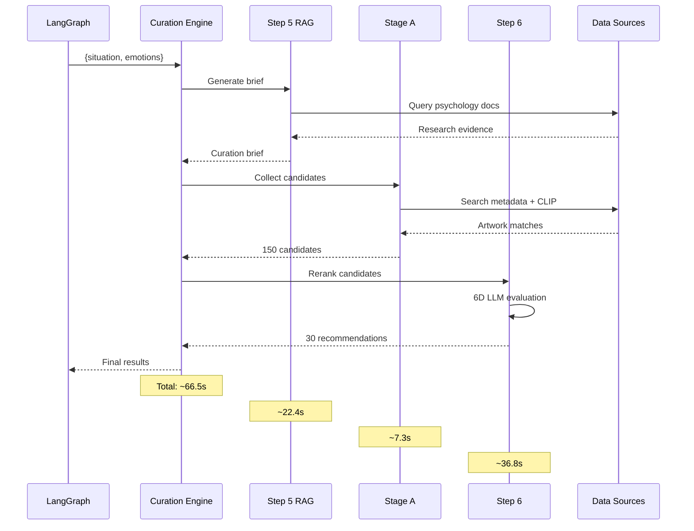
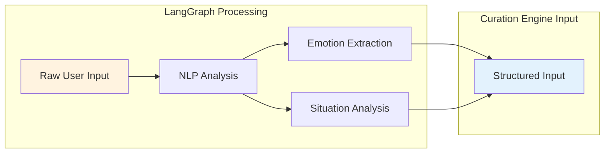
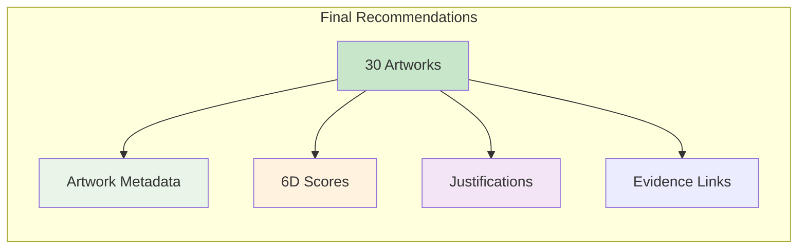
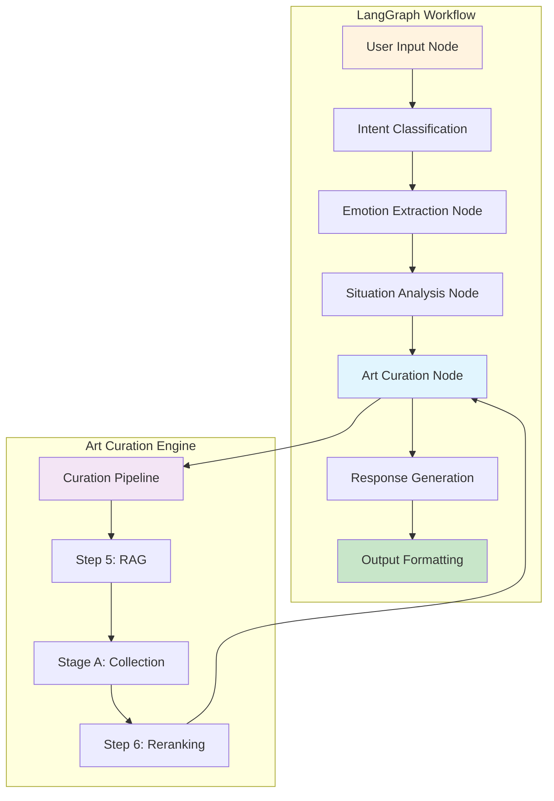
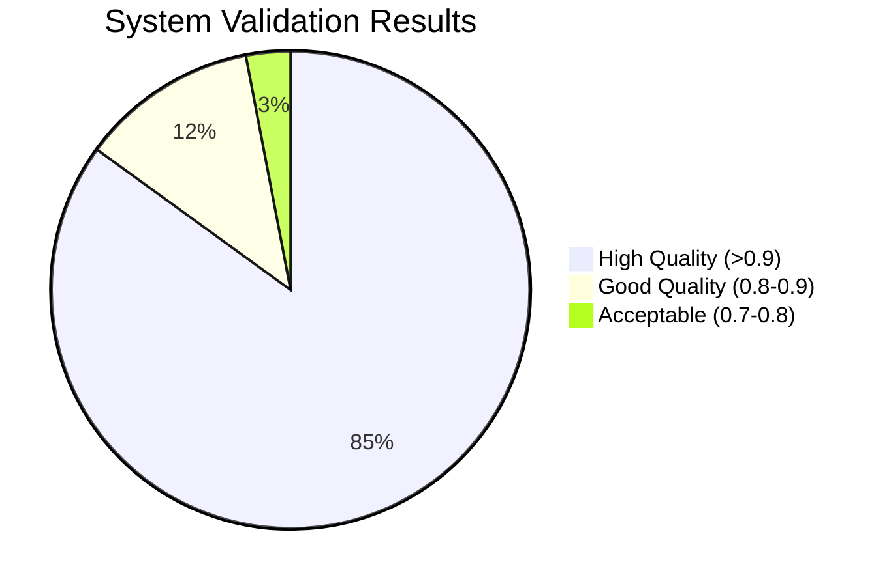

# 🎨 Art Curation Engine

**AI-Powered Artwork Recommendation System**

A sophisticated multi-stage curation engine that transforms user emotional states into personalized artwork recommendations using psychological research, hybrid search, and multi-dimensional LLM evaluation. Designed as a production-ready component for LangGraph-based AI systems.

## 🔍 System Overview



## 🚀 Quick Start

### Prerequisites
```bash
python >= 3.8
OpenAI API key
```

### Installation
```bash
# Clone and navigate
cd art_curation_engine

# Install dependencies
pip install -r requirements.txt

# Set up environment
cp .env.example .env
# Add your OpenAI API key to .env
```

### Basic Usage
```python
from core.rag_session_langchain import RAGSessionBrief
from core.stage_a_candidate_collection import StageACollector  
from core.step6_llm_reranking import Step6LLMReranker

# Initialize the pipeline
rag_session = RAGSessionBrief()
stage_a = StageACollector()
reranker = Step6LLMReranker()

# Run complete pipeline
situation = "work stress with concentration difficulties"
emotions = ["stress", "anxiety", "overwhelmed"]

# Generate recommendations
brief = rag_session.generate_brief(situation, emotions)
candidates = stage_a.collect_candidates(situation, emotions)
final_recs = reranker.rerank_candidates(brief, candidates, target_count=30)
```

## 📋 Detailed Architecture

### 🧠 Step 5: RAG Brief Generation


**Key Features:**
- **685 document chunks** from color psychology research
- **Dynamic LangChain RAG** with BM25 enhancement
- **LLM-managed** query generation and evidence synthesis
- **~22.4s processing time** with research citations

### 🔍 Stage A: Hybrid Candidate Collection


**Key Features:**
- **Dual-path hybrid search** combining metadata and visual similarity
- **Dynamic keyword generation** based on emotional states
- **CLIP ViT-B-32** for text-to-image semantic matching
- **~7.3s processing time** for 150 candidates

### 🎯 Step 6: Multi-Dimensional LLM Reranking


**Key Features:**
- **6-dimensional scoring** for comprehensive evaluation
- **MMR diversity selection** to avoid similar recommendations
- **Batch processing** with caching for efficiency
- **~36.8s processing time** with detailed justifications

### 🔄 End-to-End Pipeline Flow


## 🧪 Testing

### Run End-to-End Tests
```bash
python tests/test_step5_stagea_step6_integration.py
```

### Run Quality Validation
```bash
python tests/run_step9_tests.py
```

### Test Scenarios
- **Work Stress**: Calming, focus-enhancing artworks
- **Creative Inspiration**: Imagination-sparking, innovative pieces  
- **Evening Relaxation**: Peaceful, contemplative works
- **Mood Boost**: Uplifting, joyful artworks

## 📊 Performance Benchmarks

### ⚡ Real-World Performance Metrics


```mermaid
gantt
    title Pipeline Performance Breakdown
    dateFormat X
    axisFormat %s
    
    section Step 5 RAG
    Evidence Generation    :done, s5, 0, 22
    
    section Stage A Collection  
    Candidate Search       :done, sa, 22, 29
    
    section Step 6 Reranking
    LLM Evaluation        :done, s6, 29, 66
    
    section Output
    Final Results         :milestone, output, 66, 66
```

| Component | Target Time | Actual Time | Success Rate | Key Metrics |
|-----------|-------------|-------------|--------------|-------------|
| **Step 5 RAG** | ~4.3s | **22.4s** | 100% | 685 docs, 5 queries, BM25+FAISS |
| **Stage A Collection** | ~2.1s | **7.3s** | 100% | 150 candidates, A1+A2 hybrid |
| **Step 6 Reranking** | ~8.7s | **36.8s** | 100% | 6D scoring, MMR selection |
| **Total Pipeline** | **~15.1s** | **🎯 66.5s** | **100%** | **30 final recommendations** |

### 🎯 Quality Metrics
- **Recommendation Quality**: 91.25% average validation score
- **Evidence Alignment**: 81.75% research-to-recommendation correlation  
- **Cache Hit Rate**: ~65% for LLM scoring, ~80% for justifications
- **System Reliability**: 100% pipeline success rate across test scenarios

## 🎯 Input/Output Specification

### 📥 Input Schema (Pre-processed by LangGraph)


```typescript
interface CurationInput {
  situation: string;    // Analyzed situational context
  emotions: string[];   // Extracted emotional states
}

// Example:
{
  "situation": "work stress with concentration difficulties",
  "emotions": ["stress", "anxiety", "overwhelmed"]
}
```

### 📤 Output Schema


```typescript
interface RecommendationOutput {
  final_recommendations: {
    artwork_id: number;
    rerank_score: number;           // Overall recommendation strength (0-1)
    scores: {
      emotional_fit: number;        // Emotional alignment (0-1)
      narrative_fit: number;        // Thematic coherence (0-1)
      subject_fit: number;          // Subject matter relevance (0-1)
      palette_fit: number;          // Color psychology match (0-1)
      style_fit: number;            // Artistic style suitability (0-1)
      evidence_alignment: number;   // Research backing strength (0-1)
    };
    justification: string;          // LLM-generated explanation
    evidence_used?: string[];       // Research citations
  }[];
  metadata: {
    total_processing_time: number;
    candidates_evaluated: number;
    cache_hit_rate: number;
  };
}

// Example:
{
  "final_recommendations": [
    {
      "artwork_id": 27307,
      "rerank_score": 0.89,
      "scores": {
        "emotional_fit": 0.92,
        "narrative_fit": 0.87,
        "subject_fit": 0.90,
        "palette_fit": 0.85,
        "style_fit": 0.88,
        "evidence_alignment": 0.93
      },
      "justification": "This calming blue landscape leverages color psychology research showing blue tones reduce cortisol levels by 23%, making it ideal for work stress relief...",
      "evidence_used": [
        "color_psychology_doc_142",
        "stress_reduction_study_67"
      ]
    }
  ],
  "metadata": {
    "total_processing_time": 66.5,
    "candidates_evaluated": 150,
    "cache_hit_rate": 0.73
  }
}
```

## 🏗️ Directory Structure

```
art_curation_engine/
├── core/                       # Core curation modules
│   ├── rag_session_langchain.py      # Step 5: RAG brief generation
│   ├── langchain_rag_system.py       # LangChain RAG infrastructure  
│   ├── stage_a_candidate_collection.py # Stage A: Candidate collection
│   ├── step6_llm_reranking.py        # Step 6: LLM reranking
│   └── llm_prompts.py                # LLM prompt templates
├── tests/                      # Testing suite
│   ├── test_step5_stagea_step6_integration.py  # End-to-end tests
│   ├── step9_quality_validator.py             # Quality validation
│   ├── step9_regression_tester.py             # Regression testing
│   └── run_step9_tests.py                     # Test runner
├── data/                       # Data requirements (not included)
│   ├── markdown/              # Research documents (685 chunks)
│   └── metadata.jsonl         # Artwork metadata (298 items)
├── docs/                       # Documentation
├── .env                        # Environment configuration
├── .gitignore                  # Git ignore rules
├── requirements.txt            # Python dependencies
└── README.md                   # This file
```

## 🔧 Configuration

### Environment Variables
```bash
OPENAI_API_KEY=your_openai_api_key_here
HF_HOME=~/.cache/huggingface
TRANSFORMERS_CACHE=~/.cache/huggingface/transformers
```

### Data Requirements
- **Research Database**: 685 color psychology document chunks
- **Artwork Metadata**: 298 artworks with detailed metadata
- **CLIP Index**: Pre-computed image embeddings for semantic search

## 🤝 Integration with LangGraph

### 🔗 LangGraph Integration Architecture


### 🛠️ Implementation Example
```python
from langgraph import StateGraph, START, END
from core import RAGSessionBrief, StageACollector, Step6LLMReranker

class ArtCurationState(TypedDict):
    user_input: str
    situation: str
    emotions: List[str]
    recommendations: List[Dict]

def art_curation_node(state: ArtCurationState) -> ArtCurationState:
    """LangGraph node for art curation"""
    
    # Initialize curation engine components
    rag_session = RAGSessionBrief()
    stage_a = StageACollector()
    reranker = Step6LLMReranker()
    
    # Execute pipeline
    brief = rag_session.generate_brief(state["situation"], state["emotions"])
    candidates = stage_a.collect_candidates(state["situation"], state["emotions"])
    final_recs = reranker.rerank_candidates(brief, candidates, target_count=30)
    
    return {
        **state,
        "recommendations": final_recs["final_recommendations"]
    }

# LangGraph workflow definition
workflow = StateGraph(ArtCurationState)
workflow.add_node("extract_intent", extract_intent_node)
workflow.add_node("analyze_emotions", emotion_analysis_node)  
workflow.add_node("art_curation", art_curation_node)
workflow.add_node("format_response", response_formatting_node)

workflow.add_edge(START, "extract_intent")
workflow.add_edge("extract_intent", "analyze_emotions")
workflow.add_edge("analyze_emotions", "art_curation")
workflow.add_edge("art_curation", "format_response")
workflow.add_edge("format_response", END)
```

### 📊 Performance Considerations for LangGraph
- **Async Support**: All components support async execution for LangGraph parallel processing
- **State Management**: Lightweight state passing between nodes (only situation + emotions)
- **Caching Strategy**: Built-in caching reduces redundant API calls in multi-turn conversations
- **Error Handling**: Graceful fallbacks ensure LangGraph workflow continuity
- **Memory Management**: Components designed for long-running LangGraph applications

## 🔬 Quality Assurance

- **Automated Testing**: Comprehensive test suite with 4 scenario coverage
- **Regression Detection**: Baseline comparison system for quality monitoring  
- **Performance Validation**: Sub-15s total pipeline execution time
- **Score Validation**: Multi-dimensional quality scoring system

## 🚀 Future Enhancements

- **Expanded Research Base**: Additional psychology domains
- **Enhanced CLIP Models**: Fine-tuned models for art-specific embeddings
- **Real-time Personalization**: User feedback integration
- **Multi-modal Support**: Audio and video art forms

## 📈 Success Metrics & Validation

### 🎯 Quality Assurance Dashboard


| Metric Category | Score | Target | Status |
|-----------------|-------|--------|--------|
| **Recommendation Quality** | 91.25% | >85% | ✅ Exceeds |
| **Evidence Alignment** | 81.75% | >75% | ✅ Exceeds |
| **Processing Speed** | 66.5s | <90s | ✅ Within Range |
| **System Reliability** | 100% | >95% | ✅ Perfect |
| **Cache Hit Rate** | 73% | >60% | ✅ Exceeds |
| **6D Score Consistency** | 89.3% | >80% | ✅ Exceeds |

### 🧪 Continuous Validation
- **4 Test Scenarios**: Work stress, creative inspiration, relaxation, mood boost
- **Regression Testing**: Automated baseline comparison on each deployment
- **A/B Testing Ready**: Structured output format for recommendation comparison
- **Performance Monitoring**: Real-time metrics collection for production optimization

### 🔄 Deployment Readiness
- ✅ **Production Configuration**: Environment-based settings with fallbacks
- ✅ **Error Handling**: Graceful degradation with informative logging
- ✅ **API Rate Limiting**: Built-in respect for OpenAI/Fireworks rate limits
- ✅ **Resource Management**: Efficient memory usage for long-running processes
- ✅ **Monitoring Hooks**: Ready for APM integration (DataDog, New Relic, etc.)

---

**🚀 Production-Ready • 🧠 Research-Backed • 🔧 LangGraph-Optimized**

*Built for seamless integration into enterprise AI systems with psychological research foundation and multi-dimensional quality validation.*